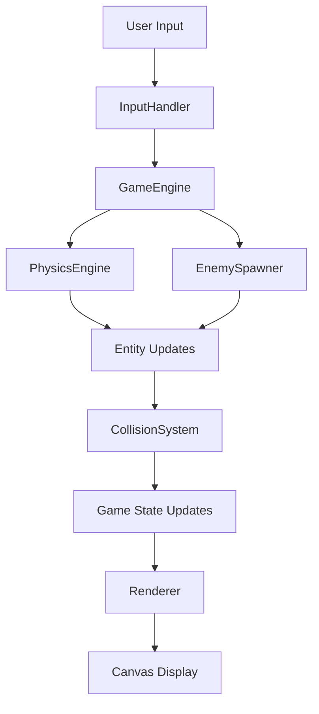

# Design Document: Kiro Phantoms

## Overview

Kiro Phantoms is a browser-based arcade game built with vanilla JavaScript, HTML5 Canvas, and CSS. The architecture follows a component-based game engine pattern with clear separation between rendering, physics, input handling, and game state management. The game runs entirely client-side with no server dependencies, making it easily deployable as static files.

The core game loop uses `requestAnimationFrame` for smooth 60 FPS rendering. The physics system implements simple Newtonian mechanics for gravity and velocity. Collision detection uses axis-aligned bounding box (AABB) intersection tests for performance. The enemy spawning system uses randomized timers to create varied gameplay.

## Architecture

### High-Level Structure

```
index.html (Entry point)
├── styles.css (Visual styling)
└── game.js (Game engine)
    ├── GameEngine (Main controller)
    ├── InputHandler (Keyboard/touch input)
    ├── Renderer (Canvas drawing)
    ├── PhysicsEngine (Movement/gravity)
    ├── CollisionSystem (Hit detection)
    ├── EnemySpawner (Enemy creation)
    └── Entities
        ├── Kiro (Player)
        ├── Pelican (Enemy)
        └── Shark (Enemy)
```

### Component Responsibilities

**GameEngine**: Orchestrates the game loop, manages game state transitions (start, playing, game over), coordinates all subsystems, and maintains the master entity list.

**InputHandler**: Listens for spacebar presses and touch events, translates them into game actions, and handles device-specific input differences.

**Renderer**: Draws all game entities to the canvas, manages sprite rendering, handles background layers (sky, clouds, ocean), and renders UI elements (hearts, game over screen).

**PhysicsEngine**: Updates entity positions based on velocity, applies gravity to Kiro and sharks, enforces boundary constraints, and calculates parabolic trajectories for sharks.

**CollisionSystem**: Performs AABB intersection tests between Kiro and enemies, triggers collision events, and manages invincibility frames to prevent multiple hits from single collision.

**EnemySpawner**: Manages spawn timers for pelicans and sharks, creates enemy entities at appropriate positions, enforces maximum enemy counts, and removes off-screen enemies.

### Data Flow



## Components and Interfaces

### GameEngine

```javascript
class GameEngine {
  constructor(canvasId)
  init()
  start()
  gameLoop(timestamp)
  update(deltaTime)
  render()
  handleCollision(entity1, entity2)
  gameOver()
  restart()
  
  // State
  state: 'start' | 'playing' | 'gameover'
  entities: Array<Entity>
  kiro: Kiro
  lives: number
  lastTimestamp: number
}
```

### Entity Base Class

```javascript
class Entity {
  constructor(x, y, width, height)
  update(deltaTime)
  render(ctx)
  getBounds()
  
  // Properties
  x: number
  y: number
  width: number
  height: number
  velocityX: number
  velocityY: number
  active: boolean
}
```

### Kiro (Player)

```javascript
class Kiro extends Entity {
  constructor(x, y)
  jump()
  update(deltaTime)
  render(ctx)
  
  // Properties
  jumpStrength: number = -400
  gravity: number = 1200
  maxFallSpeed: number = 600
}
```

### Pelican (Enemy)

```javascript
class Pelican extends Entity {
  constructor(x, y)
  update(deltaTime)
  render(ctx)
  
  // Properties
  speed: number = -200
  animationFrame: number
  animationSpeed: number
}
```

### Shark (Enemy)

```javascript
class Shark extends Entity {
  constructor(x, oceanY)
  update(deltaTime)
  render(ctx)
  
  // Properties
  initialVelocityY: number = -500
  gravity: number = 1200
  oceanY: number
  animationFrame: number
}
```

### InputHandler

```javascript
class InputHandler {
  constructor(gameEngine)
  init()
  handleKeyDown(event)
  handleTouchStart(event)
  destroy()
  
  // Properties
  gameEngine: GameEngine
  keyListeners: Array<Function>
  touchListeners: Array<Function>
}
```

### Renderer

```javascript
class Renderer {
  constructor(canvas)
  clear()
  drawBackground()
  drawOcean()
  drawClouds()
  drawEntity(entity)
  drawHearts(lives)
  drawStartScreen()
  drawGameOverScreen()
  
  // Properties
  canvas: HTMLCanvasElement
  ctx: CanvasRenderingContext2D
  cloudPositions: Array<{x, y}>
}
```

### PhysicsEngine

```javascript
class PhysicsEngine {
  applyGravity(entity, gravity, deltaTime)
  updatePosition(entity, deltaTime)
  clampToTopBound(entity, minY)
  
  // Constants
  GRAVITY: number = 1200
}
```

### CollisionSystem

```javascript
class CollisionSystem {
  checkCollision(entity1, entity2)
  checkOceanCollision(kiro, oceanY)
  checkAllCollisions(kiro, enemies, oceanY)
  
  // Returns
  checkCollision(): boolean
  checkOceanCollision(): boolean
  checkAllCollisions(): Array<Entity | 'ocean'>
}
```

### EnemySpawner

```javascript
class EnemySpawner {
  constructor(gameEngine, canvasWidth, canvasHeight, oceanY)
  update(deltaTime)
  spawnPelican()
  spawnShark()
  cleanupOffscreenEnemies()
  
  // Properties
  pelicanTimer: number
  sharkTimer: number
  pelicanInterval: number
  sharkInterval: number
  maxPelicans: number = 2
  maxSharks: number = 1
}
```

## Data Models

### Game State

```javascript
{
  state: 'start' | 'playing' | 'gameover',
  lives: number,
  entities: Array<Entity>,
  kiro: Kiro,
  canvas: {
    width: number,
    height: number
  },
  oceanY: number,
  skyHeight: number
}
```

### Entity Data

```javascript
{
  x: number,              // X position in pixels
  y: number,              // Y position in pixels
  width: number,          // Sprite width
  height: number,         // Sprite height
  velocityX: number,      // Horizontal velocity (pixels/second)
  velocityY: number,      // Vertical velocity (pixels/second)
  active: boolean,        // Whether entity should be updated/rendered
  type: 'kiro' | 'pelican' | 'shark'
}
```

### Bounding Box

```javascript
{
  left: number,    // x position
  right: number,   // x + width
  top: number,     // y position
  bottom: number   // y + height
}
```

### Sprite Configuration

```javascript
{
  kiro: {
    width: 40,
    height: 40,
    color: '#FFFFFF',
    startX: 100,
    startY: 200
  },
  pelican: {
    width: 60,
    height: 40,
    beakColor: '#FF8C00',
    bodyColor: '#FFFFFF',
    speed: 200
  },
  shark: {
    width: 70,
    height: 50,
    bodyColor: '#4A5568',
    mouthColor: '#FF0000',
    jumpVelocity: 500
  },
  heart: {
    width: 30,
    height: 30,
    color: '#FF0000',
    spacing: 10
  }
}
```

### Canvas Layout

```javascript
{
  totalHeight: window.innerHeight,
  oceanHeight: totalHeight * 0.2,      // Bottom 20% (hazard zone)
  skyHeight: totalHeight * 0.8,        // Top 80%
  oceanY: totalHeight * 0.8,           // Ocean starts at 80% down (hazard boundary)
  playableMinY: 0,
  playableMaxY: totalHeight            // No lower bound - ocean is a hazard
}
```

## Correctness Properties


A property is a characteristic or behavior that should hold true across all valid executions of a system—essentially, a formal statement about what the system should do. Properties serve as the bridge between human-readable specifications and machine-verifiable correctness guarantees.

### Property 1: Jump Input Triggers Upward Velocity

*For any* game state where Kiro is controllable, when a jump input is triggered (spacebar or touch), Kiro's vertical velocity should become negative (upward).

**Validates: Requirements 1.1, 1.2, 1.3**

### Property 2: Gravity Increases Downward Velocity

*For any* entity affected by gravity (Kiro or Shark), over any time interval without upward input, the vertical velocity should increase in the positive (downward) direction.

**Validates: Requirements 1.4, 4.4**

### Property 3: Boundary Clamping Prevents Out-of-Bounds

*For any* entity position update, if the entity would move beyond the top boundary of the playable area, the position should be clamped to remain within valid bounds.

**Validates: Requirements 1.5**

### Property 4: Collision Decreases Lives

*For any* collision event between Kiro and an enemy entity or the ocean surface, Kiro's life count should decrease by exactly 1.

**Validates: Requirements 2.3, 2.4, 5.6, 5.7**

### Property 5: Lives Display Matches Life Count

*For any* game state, the number of heart icons rendered should equal the current life count.

**Validates: Requirements 2.2, 6.6**

### Property 6: Zero Lives Triggers Game Over

*For any* game state where lives reach 0, the game state should transition to Game_Over_State.

**Validates: Requirements 2.4, 8.4**

### Property 7: Game Over Prevents Gameplay Updates

*For any* frame while in Game_Over_State, entity positions should not change and user input should not affect game entities.

**Validates: Requirements 2.5**

### Property 8: Enemies Spawn Over Time

*For any* sufficiently long time interval during gameplay, at least one enemy (pelican or shark) should be spawned.

**Validates: Requirements 3.1, 4.1**

### Property 9: Pelicans Spawn at Right Edge

*For any* spawned pelican, its initial x position should be at or beyond the right edge of the canvas, and its y position should be within the playable sky area (between 0 and oceanY).

**Validates: Requirements 3.2, 10.3**

### Property 10: Pelican Velocity Remains Constant

*For any* active pelican over multiple frames, its horizontal velocity should remain constant (negative, moving left).

**Validates: Requirements 3.3**

### Property 11: Off-Screen Entities Are Removed

*For any* entity that moves completely beyond the visible canvas boundaries, it should be marked as inactive or removed from the active entity list.

**Validates: Requirements 3.4, 4.5**

### Property 12: Sharks Spawn at Ocean Surface

*For any* spawned shark, its initial y position should be at the ocean surface (oceanY), and its x position should be within the canvas width.

**Validates: Requirements 4.2, 10.4**

### Property 13: Shark Trajectory Is Parabolic

*For any* shark from spawn to ocean return, the vertical position over time should follow a parabolic curve (y = y0 + v0*t + 0.5*g*t²).

**Validates: Requirements 4.3**

### Property 14: Entity Animations Update Over Time

*For any* animated entity (pelican or shark), the animation frame counter should increment over time during gameplay.

**Validates: Requirements 3.5, 4.6**

### Property 15: AABB Collision Detection

*For any* pair of entities (Kiro and enemy) or Kiro and the ocean surface, if their bounding boxes overlap (Kiro.right > Target.left AND Kiro.left < Target.right AND Kiro.bottom > Target.top AND Kiro.top < Target.bottom), a collision should be registered.

**Validates: Requirements 5.1, 5.2, 5.3, 5.4, 5.5**

### Property 16: Collision Triggers Visual Feedback

*For any* collision event (with enemy or ocean), some visual state change should occur (such as a flash, color change, or animation trigger).

**Validates: Requirements 5.8**

### Property 17: Colliding Enemies Are Removed

*For any* enemy that collides with Kiro, that enemy should be marked as inactive or removed from the entity list.

**Validates: Requirements 5.9**

### Property 18: Ocean Contact Decreases Lives

*For any* frame where Kiro's position touches or overlaps the ocean surface, a collision should be registered and lives should decrease by 1.

**Validates: Requirements 2.4, 5.5, 5.7**

### Property 19: Frame Rate Meets Minimum Threshold

*For any* sequence of 100 consecutive frames during gameplay, the average time between frames should be 33ms or less (30 FPS minimum).

**Validates: Requirements 6.8**

### Property 20: Canvas Maintains Horizontal Orientation

*For any* canvas configuration, the width should be greater than the height.

**Validates: Requirements 7.1**

### Property 20: Canvas Scales Proportionally

*For any* window resize event, the canvas aspect ratio should remain constant.

**Validates: Requirements 7.4**

### Property 21: Entities Scale With Canvas

*For any* screen size, all entity dimensions should scale proportionally with the canvas dimensions, maintaining their relative sizes.

**Validates: Requirements 7.5**

### Property 22: Start Screen Transitions to Playing

*For any* input event while in start state, the game state should transition to playing state.

**Validates: Requirements 8.2**

### Property 23: Playing State Executes Game Loop

*For any* frame while in playing state, both update and render functions should be called.

**Validates: Requirements 8.3**

### Property 24: Game Over Provides Restart Option

*For any* game state in Game_Over_State, a restart action should be available that resets the game to initial conditions.

**Validates: Requirements 8.6**

### Property 25: Movement Scales With Delta Time

*For any* two consecutive frames with different delta times, entity position changes should be proportional to their respective delta times (position_change = velocity * deltaTime).

**Validates: Requirements 9.5**

### Property 26: Resize Events Don't Break Game

*For any* window resize event during gameplay, the game should continue functioning without errors and all entities should remain valid.

**Validates: Requirements 9.6**

### Property 27: Spawn Intervals Within Range

*For any* enemy spawn event, the time since the last spawn of that enemy type should fall within the specified range (2-4s for pelicans, 4-8s for sharks).

**Validates: Requirements 10.1, 10.2**

### Property 28: Maximum Simultaneous Enemy Counts Enforced

*For any* game state during gameplay, the number of simultaneously active pelicans should not exceed 2, and the number of simultaneously active sharks should not exceed 1. Enemies spawn indefinitely throughout the game.

**Validates: Requirements 10.5, 10.6**

## Error Handling

### Input Errors

**Invalid Input Events**: The InputHandler should ignore any input events that occur during non-interactive states (game over, loading). Event listeners should check game state before processing input.

**Rapid Input Spam**: Multiple jump inputs in quick succession should not stack velocity. The jump action should only apply if Kiro is not already at maximum upward velocity or if sufficient time has passed since the last jump.

### Rendering Errors

**Canvas Context Loss**: If the canvas context is lost (rare browser event), the game should attempt to restore the context and reinitialize rendering. If restoration fails, display an error message to the user.

**Invalid Sprite Dimensions**: If entity dimensions become invalid (negative, zero, or NaN), reset the entity to default dimensions or remove it from the game to prevent rendering errors.

### Physics Errors

**NaN Velocity Values**: If any entity's velocity becomes NaN (from division by zero or invalid calculations), reset the velocity to zero and log a warning.

**Extreme Velocity Values**: Cap maximum velocities to prevent entities from moving too fast and potentially skipping through collision detection. Maximum velocities: Kiro vertical = 600px/s, Pelican horizontal = 300px/s, Shark vertical = 800px/s.

**Boundary Violations**: If an entity somehow ends up outside valid boundaries despite clamping, force-reset its position to the nearest valid boundary.

### Game State Errors

**Invalid State Transitions**: Validate all state transitions. Only allow: start → playing, playing → gameover, gameover → start. Reject any other transitions and log an error.

**Negative Lives**: If lives somehow become negative (should be prevented by game logic), clamp to zero and trigger game over immediately.

### Spawning Errors

**Spawn Position Out of Bounds**: If a calculated spawn position is outside valid ranges, clamp it to valid boundaries before creating the entity.

**Excessive Entity Count**: If entity count exceeds maximum limits despite spawn prevention logic, stop spawning new entities until count drops below threshold.

**Timer Overflow**: Reset spawn timers if they exceed a maximum threshold (e.g., 1000 seconds) to prevent potential overflow issues in long-running games.

### Performance Degradation

**Frame Rate Drop**: If frame rate drops below 20 FPS for more than 5 consecutive seconds, reduce enemy spawn rates by 50% to improve performance.

**Memory Leaks**: Ensure all removed entities are properly dereferenced and event listeners are cleaned up to prevent memory leaks during long play sessions.

## Testing Strategy

### Dual Testing Approach

The testing strategy employs both unit tests and property-based tests to ensure comprehensive coverage:

**Unit Tests** focus on:
- Specific examples of game behavior (e.g., "game starts with 5 lives")
- Edge cases (e.g., "Kiro at exact boundary position")
- Integration points between components (e.g., "InputHandler triggers GameEngine jump")
- Error conditions (e.g., "invalid spawn position is clamped")

**Property-Based Tests** focus on:
- Universal properties that hold for all inputs (e.g., "collision always decreases lives by 1")
- Comprehensive input coverage through randomization
- Physics correctness across all possible states
- Invariants that must always hold

Together, these approaches provide both concrete validation of specific scenarios and broad verification of general correctness.

### Property-Based Testing Configuration

**Testing Library**: Use a JavaScript property-based testing library such as `fast-check` or `jsverify`.

**Test Configuration**:
- Each property test should run a minimum of 100 iterations
- Use appropriate generators for game entities, positions, velocities, and time deltas
- Each test must include a comment tag referencing the design property

**Tag Format**:
```javascript
// Feature: kiro-phantoms, Property 1: Jump Input Triggers Upward Velocity
```

**Generator Requirements**:
- Position generators: Random x/y within canvas bounds
- Velocity generators: Random velocities within realistic ranges (-600 to 600 px/s)
- Time delta generators: Random frame times (16ms to 50ms for 60-20 FPS)
- Entity generators: Random valid entity configurations
- Game state generators: Random valid game states with varying entity counts

### Unit Test Coverage

**Core Functionality Tests**:
- Game initialization (lives = 5, state = start)
- Jump mechanics (spacebar and touch input)
- Collision detection with known overlapping positions
- Life decrease on collision
- Game over at zero lives
- Entity spawning at correct positions
- Entity removal when off-screen

**Edge Case Tests**:
- Kiro at exact top boundary
- Kiro at exact ocean surface
- Collision at entity edges (barely touching)
- Maximum enemy count reached
- Rapid input spam
- Window resize during gameplay
- Game over during collision

**Integration Tests**:
- Full game loop execution
- Input → Physics → Collision → Rendering pipeline
- State transitions (start → playing → gameover → start)
- Enemy spawning and cleanup over time
- Multiple simultaneous collisions

### Test Organization

```
tests/
├── unit/
│   ├── game-engine.test.js
│   ├── input-handler.test.js
│   ├── physics-engine.test.js
│   ├── collision-system.test.js
│   ├── enemy-spawner.test.js
│   └── renderer.test.js
├── property/
│   ├── jump-physics.property.test.js
│   ├── collision-detection.property.test.js
│   ├── enemy-behavior.property.test.js
│   ├── boundary-constraints.property.test.js
│   └── game-state.property.test.js
└── integration/
    ├── full-game-loop.test.js
    └── state-transitions.test.js
```

### Manual Testing Checklist

While automated tests cover functional correctness, manual testing should verify:
- Visual appearance matches pixel art aesthetic
- Game feels responsive on both desktop and mobile
- Touch controls work on various mobile devices
- Game is playable and enjoyable
- Performance is smooth on target devices
- Responsive design works across screen sizes
